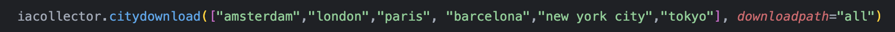
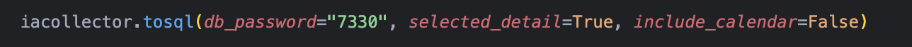

# Inside-Airbnb-Data-Collecter

## Introduction

IACollector is a tool for batch downloading, processing, and storing data from the [Inside Airbnb](http://insideairbnb.com/) into a PostgreSQL database. Its current main functions are:

- **citylist.py** will print the currently available cities and data update time(**iacollector.citylist**), it will:

  1. Download the webpage content with requests.get(), and then parse the HTML with [BeautifulSoup](https://pypi.org/project/beautifulsoup4/).
  2. Find all `<h3>` tags in webpage, which usually represent a city title.
  3. For each `<h3>`, get the city name, ignoring invalid titles such as "Get the data", "Archived", etc.
  4. Call the private method _find_dates() to find all dates from the content below the title, If the city has dates, store the city and the **maximum date (i.e. the latest data)** in a dictionary.
  5. Return a Dict[city name, latest date].
- **citydownload.py** can download Airbnb data of specified cities. It allows you to specify one or more cities (**iacollector.citydownload**). The main process is as follows:
  

  1. Find matching items in the obtained city mapping based on the city name passed in by the user, supporting fuzzy matching (for example, only entering amsterdam can also match Amsterdam, Netherlands).
  2. If a matching city is found, _download_single_city() will be called to construct a complete download URL for each city and download all corresponding .csv or .gz files.
  3. There two types of download: "**data**" will download detailed compressed data (such as listings.csv.gz, calendar.csv.gz), while "**visualisations**" will download simplified data for visualization (such as listings.csv, neighbourhoods.geojson).
  4. **downloadpath** allows to input three parameters: all, data, and visualisations, representing different download sources respectively. It defaults to all.
  5. When the corresponding file already exists locally, it will be skipped and support breakpoint resuming.
- **tosql** will import the unpacked Airbnb data into the PostgreSQL database (**iacollector.tosql**):
  

  1. Initialize the PostgreSQL connection and create the **ia_detail**(**visualisations**) and **ia_simple**(**data**) databases with a schema for each city.(Will be skipped if it already exists)
  2. Unzip the downloaded file and do some basic preprocessing, such as price fields. And specify **listing_id** as the primary key of the listings and reviews tables.
  3. There are two parameters: **selected_detail = True/False** means whether to pass all fields from the listings table in the visualizations path, **include_calendar = True/False** means whether to pass the calendar to ia_detail. (because the calendar is a very large data set)
- **createhosts** will be extracted from the listings data table and aggregated into a new table with host_id as the primary key.(**iacollector.createhosts**)
